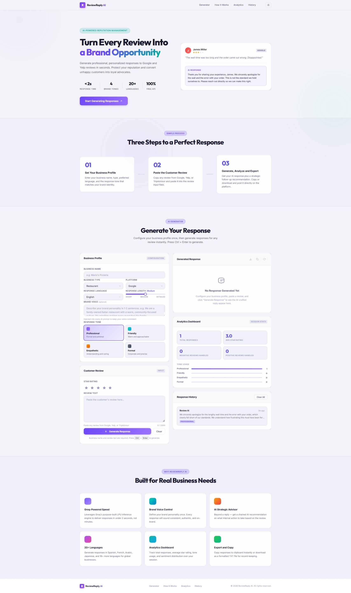

<div align="center">



# ReviewReply AI

**Turn Every Review Into a Brand Opportunity**

Generate professional, on-brand responses to customer reviews in seconds.  
Protect your reputation, retain customers, and save hours every week.

[](https://developer.mozilla.org/en-US/docs/Web/HTML)
[](https://developer.mozilla.org/en-US/docs/Web/CSS)
[](https://developer.mozilla.org/en-US/docs/Web/JavaScript)
[](LICENSE)

</div>

---

## Overview

**ReviewReply AI** is a fully client-side web application that helps business owners craft personalized, professional responses to customer reviews — fast. Paste a review, configure your brand profile, and receive a tailored reply in under 2 seconds. The platform also provides strategic follow-up advice, session analytics, multilingual support, and an AI assistant — all without requiring a backend or database.

---

## Features

### Core Generator
- **AI-Powered Responses** — Generate contextually aware, tone-matched replies to any customer review
- **4 Response Tones** — Professional, Friendly, Empathetic, Formal
- **Response Length Control** — Choose Short (50–70 words), Medium (80–120 words), or Detailed (130–180 words) via an interactive slider
- **Star Rating Input** — Set the review's star rating to guide the AI's approach
- **Brand Voice Profile** — Describe your brand personality once; it's injected into every response automatically

### Multi-Language Support
- Generate responses in **22 languages** including Spanish, French, Arabic, Japanese, Chinese (Simplified), Hindi, Bengali, Portuguese, German, and more
- Ideal for global businesses serving diverse customer bases

### Strategic Follow-Up Advisor
- After each response, a **second AI call** generates a private, internal operational recommendation
- Tells you *what action to take inside your business* based on the review — not just what to say to the customer
- Displayed in a distinct teal-accented advisory card

### Analytics Dashboard
- Tracks **total responses**, **average star rating**, **positive / negative / mixed** review counts, and **tone breakdown** — all in real time
- Data is persisted via `localStorage` and survives page refreshes
- Animated bar charts display tone usage trends visually

### Response History
- Stores the last **10 generated responses** in `localStorage`
- Click any history item to instantly reload its review, response, and insights
- Includes business name, timestamp, tone, and language

### Export & Copy
- **Copy to Clipboard** — One-click copy with a visual confirmation animation
- **Export to TXT** — Downloads a formatted `.txt` file with business info, original review, generated response, and metadata

### AI Chat Assistant
- Floating **ReviewReply Assistant** widget available on every page
- Ask questions about reputation management, response strategies, or platform features
- Maintains conversation context across multiple messages
- Includes a typing indicator, clear chat, and mobile-optimized full-screen panel

### Theme Toggle
- Switch between **Dark Mode** (glassmorphism) and **Light Mode** with a single click
- Preference is saved to `localStorage`

### Keyboard Shortcut
- Press **`Ctrl + Enter`** (or `Cmd + Enter` on macOS) to generate a response instantly

---

## Screenshots


---

## Project Structure

```
ReviewReply_AI/
├── index.html          # Single-page application shell
├── style.css           # All styling — glassmorphism, dark/light themes, responsive layout
├── app.js              # All application logic — AI calls, state, analytics, chatbot, history
├── screenshots/        # Project preview images
└── README.md           # This file
```

---

## Getting Started

ReviewReply AI is a **zero-dependency, client-side only** application. No build tools, no npm, no server required.

### 1. Clone or Download

```bash
git clone https://github.com/yourusername/ReviewReply_AI.git
cd ReviewReply_AI
```

Or simply [download the ZIP](https://github.com/yourusername/ReviewReply_AI/archive/refs/heads/main.zip) and extract it.

### 2. Open in Browser

```bash
# Option A — just double-click
open index.html

# Option B — serve locally (recommended to avoid CORS issues)
npx serve .
# or
python -m http.server 8080
```

Then visit `http://localhost:8080` in your browser.

### 3. Configure Your API Key

Open `app.js` and locate the `CONFIG` object near the top:

```js
const CONFIG = {
    GROQ_API_KEY: 'your_api_key_here',
    // ...
};
```

Replace `'your_api_key_here'` with your API key. You can obtain one for free at [console.groq.com](https://console.groq.com).

> **Note:** For production deployments, do not expose your API key in client-side code. Use a backend proxy instead.

---

## How It Works

```
1. You fill in your Business Profile
   └─ Name, Type, Platform, Language, Response Length, Brand Voice

2. You paste the customer review + set a star rating

3. Click "Generate Response" (or press Ctrl + Enter)
   └─ AI Call #1 → Generates the customer-facing reply
   └─ AI Call #2 → Generates a private internal strategic recommendation

4. Review the output, copy or export it, and post it
```

---

## Responsive Design

The application is fully responsive across all screen sizes:

| Breakpoint | Layout |
|---|---|
| ≥ 1025px | Two-column generator, full desktop nav |
| 769px – 1024px | Single-column generator, stacked sections |
| 481px – 768px | Mobile layout, hamburger nav, compact cards |
| ≤ 480px | Small phone layout, full-width chatbot sheet |

---

## Tech Stack

| Layer | Technology |
|---|---|
| Markup | HTML5 (Semantic) |
| Styling | Vanilla CSS3 (Glassmorphism, CSS Variables, Grid, Flexbox) |
| Logic | Vanilla JavaScript (ES2022+, async/await) |
| AI Model | Large Language Model via API |
| Storage | Browser `localStorage` |
| Fonts | Google Fonts — Inter, Outfit |

---

## Roadmap

- [ ] Backend proxy for secure API key management
- [ ] User accounts with persistent cloud history
- [ ] Bulk review import (CSV/JSON)
- [ ] Review platform integrations (Google, Yelp, Trustpilot)
- [ ] Team collaboration features
- [ ] Response A/B testing

---

## Contributing

Contributions are welcome! Please open an issue first to discuss what you'd like to change.

1. Fork the repository
2. Create a feature branch (`git checkout -b feature/your-feature`)
3. Commit your changes (`git commit -m 'Add your feature'`)
4. Push to the branch (`git push origin feature/your-feature`)
5. Open a Pull Request

---

## License

This project is licensed under the **MIT License** — see the [LICENSE](LICENSE) file for details.

---

<div align="center">

&copy; 2026 ReviewReply AI. All rights reserved.

</div>
